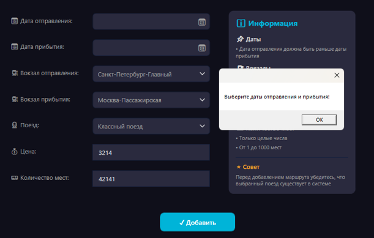

# Название проекта
Курсовая работа на тему: «Автоматизация учета станков и их дефектов»

## Описание проекта
Кратко: что делает программа, для кого она предназначена, какую проблему решает.

## Технологии
- Язык / платформа: C#, WPF, React
- СУБД: MS SQL Server (SSMS)
- Инструменты: Visual Studio, Git

## Как развернуть и запустить проект (инструкция «что куда нажать»)

### 1. Установить необходимое ПО
- Установить [Visual Studio Community](https://visualstudio.microsoft.com/ru/) (выбрать нагрузку «.NET Desktop Development»)
- Установить [SQL Server Management Studio (SSMS)](https://docs.microsoft.com/ru-ru/sql/ssms/download-sql-server-management-studio-ssms)

### 2. Развернуть базу данных
- Открыть SSMS → подключиться к серверу `(local)`
- Нажать кнопку **«New Query»**
- Открыть файл `database.sql` из репозитория
- Нажать кнопку **«Execute»** (зелёный треугольник)

### 3. Открыть проект в Visual Studio
- Скачать репозиторий: нажать на GitHub **«Code» → «Download ZIP»** или выполнить `git clone`
- Открыть файл `*.sln` в Visual Studio
- В файле `App.config` (или в коде подключения) проверить строку подключения к БД:
Server=(local);Database=StankiDB;Trusted_Connection=True;
text
- Нажать **F5** или кнопку **«Пуск»** (зелёная стрелка)

### 4. Работа с программой
- После запуска откроется главное окно
- Чтобы добавить станок: нажать кнопку **«Добавить»** → заполнить поля → **«Сохранить»**
- Чтобы зафиксировать дефект: выбрать станок → нажать **«Дефекты»** → **«Новый дефект»** → заполнить → **«Сохранить»**
- Для формирования отчёта: нажать **«Отчёты»** → выбрать период → **«Сформировать»**

## Скриншоты

## Автор
ФИО, группа, учебное заведение
